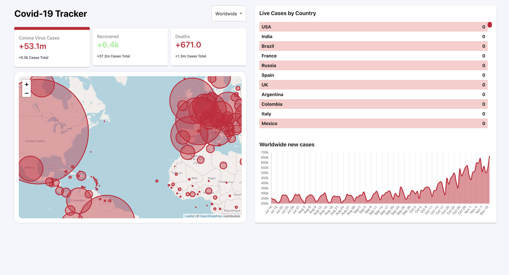

# **Covid-19 Tracker**

### Click the link to view the website

[Covid-19 Tracker Website](https://covid-track-er.web.app/)

### About Us

An application that tracks the global Covid-19 pandemic
statistics and displays the data on a map that is easily
accessible to anyone with the link.

#### Project Work:

David Sheinbein - https://github.com/davesheinbein

#### LinkedIn:

David Sheinbein -
https://www.linkedin.com/in/david-sheinbein/

## Screenshot:

[Tracker Sceenshot](https://imgur.com/oemRjpG)

## Technologies Used:

#### 1. HTML5

#### 2. CSS

#### 3. SCSS

#### 4. JavaScript

#### 5. React

#### 6. chart.js

#### 7. leaflet

#### 8. numeral

#### 9. Node.js

#### 10. Firebase

#### 11. Git

#### 12. Github

## Potential Next Steps:

##### - [X] Update CSS further for additional media queries

### Click the link to view David Sheinbeins Portfolio website

[David Sheinbein Portfolio Webstite](http://www.davidsheinbeinportfolio.com/)
